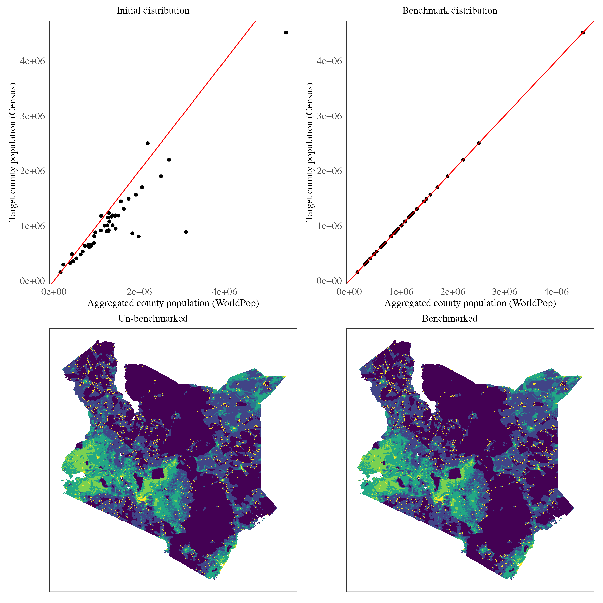
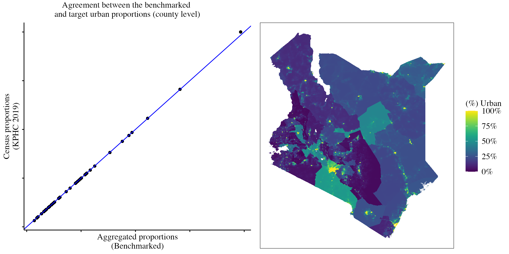
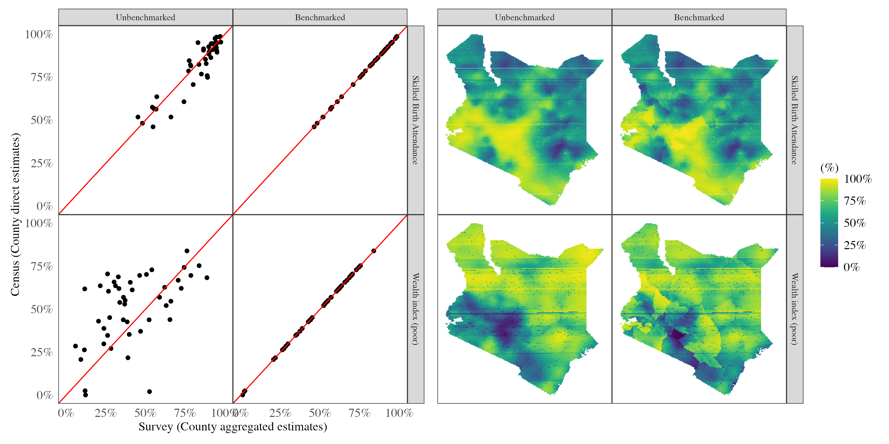

```{r, echo=F, warning=F, message=F}
# originally:       margin-width: 350px
library(pacman)
p_load(dplyr, ggplot2, sf, stringr, purrr, gridExtra, gghighlight)

scientific_theme <- theme(
  # Text elements
  text = element_text(family = "serif", color = "black"),
  plot.title = element_text(size = 12, face = "plain", hjust = 0.5),
  axis.title = element_text(size = 12, face = "plain"),
  axis.text = element_text(size = 12),
  axis.text.x = element_text(angle = 0, hjust = 0.5),
  axis.text.y = element_text(angle = 0, hjust = 1),
  legend.title = element_text(size = 12),
  legend.text = element_text(size = 12),
  
  # Plot background and grid
  panel.background = element_rect(fill = "white"),
  panel.grid = element_blank(),
  
  # Axis lines and ticks
  axis.line = element_line(color = "black"),
  axis.ticks = element_line(color = "black"),
  
  # Remove the right and top axis lines (bty="l" equivalent)
  axis.line.y.right = element_blank(),
  axis.line.x.top = element_blank(),
  
  # Legend
  legend.background = element_rect(fill = "white"),
  legend.key = element_rect(fill = "white", color = NA),
  
  # Plot margins (approximating mar = c(5, 5, 3, 5))
  plot.margin = margin(t = 3, r = 5, b = 5, l = 5, unit = "pt"),
  
  # Expand axes to touch the data (xaxs="i", yaxs="i" equivalent)
  panel.spacing = unit(0, "lines"),
  plot.title.position = "plot"
)
```

# Introduction

Model-based small area estimation (SAE) relies on statistical models
that incorporate covariate information and/or data from neighboring
areas to enhance the precision of estimates in specific locations. These
methods are particularly valuable when domain samples are too small to
provide reliable direct estimates. However, the reliance on models makes
SAE susceptible to estimation errors, often due to model
misspecification, which can lead to discrepancies between model-based
estimates and those from more authoritative sources such as censuses or
vital statistics. Benchmarking addresses these issues by aligning small
area estimates derived from survey data with established benchmarks
(direct estimates from more credible sources) to ensure consistency and
accuracy in aggregated results (Pfeffermann, 2013). This process is
critical for producing reliable estimates that support
informed policy decisions and resource allocation.

Benchmarking plays a crucial role in small area estimation for several
reasons. First, policy makers often require estimates from various
sources to align for consistent decision-making, particularly when
allocating resources. Second, researchers/analysts may seek to enhance
estimates by integrating data from multiple sources, which benchmarking
facilitates. Benchmarking can be categorized into two types: internal
and external. Internal benchmarking involves using estimates at higher
aggregation levels to calibrate those at lower levels—for example,
ensuring that sub-county estimates, when aggregated, match county-level
estimates derived directly from survey data. External benchmarking, on the other hand,
relies on direct estimates from authoritative sources such as censuses
and vital statistics to calibrate model-based estimates.

Several approaches to benchmarking exist in the literature. Classical methods use a two-stage process: constructing a small area model to generate
estimates, followed by calibrating these estimates to match benchmark
values. However, these methods often provide only point estimates
without uncertainty measures. Advanced methods incorporate benchmark
constraints directly into the estimation process, using informative
priors or likelihood terms, thereby producing full posterior
distributions for benchmarked estimates. These approaches
are gaining importance due to their ability to provide uncertainty
measures for benchmarked estimates (Zhang & Bryant, 2020).

In this article, we focus on calibrating gridded surfaces provided by
institutions like the United Nations, as well as gridded surfaces
obtained from unit-level SAE models derived from the Demographic and
Health Surveys. The objective is to adjust unit-level estimates so that
their aggregation aligns with direct estimates from census data. Unlike
the usual benchmarking aimed at larger geographic units, our approach
operates at a fine spatial resolution of $5 \ km^2$. These gridded
surfaces are particularly valuable for spatial and spatio-temporal
modeling, including unit-level SAE models and prevalence mapping, where
high-resolution covariates are needed.

# Data

The primary dataset used in this study is the United Nations Gridded
Population Surface obtained from WorldPop (WorldPop & CIESIN, 2018).
This dataset has a spatial resolution of approximately $1 \ km^2$ and
was developed using methods that incorporate covariates related to
population density, such as land cover, road networks, and other
environmental factors. Dasymetric redistribution techniques were applied
to create pixel-level population density estimates that align with the
national population totals provided by the United Nations Population
Division (Stevens et al., 2015). Although the gridded population surface
is designed to match national totals, our focus is on benchmarking
these estimates against (sub-national) county-level totals to ensure that the
aggregated estimates accurately represent county-specific populations.

For the survey indicators, the data used was sourced from the Kenya
Demographic and Health Survey 2022 (KNBS and ICF, 2023). Detailed
information on the sampling design and other relevant details is
available on the DHS website. The indicators we use include skilled
birth attendance and the wealth index (poor). Since census data only provides information on births within the 12 months preceding August 2019, we filter the survey data to include only children born within the same period (July 2018 to September 2019) when estimating skilled birth attendance proportions. The wealth index is typically divided into quintiles: poorest, poorer, middle, richer, and richest. For this analysis, we combine the poorest and poorer categories to define the "poor" group.

## Gridded population totals

Our objective is to calibrate the gridded population surface so that its
aggregation at the county level aligns with the Kenya Population and
Housing Census population counts (2020 projections by the KNBS). We assume that the UN population
gridded surface is linearly proportional to the true population at each
spatial location $k$.

To achieve this, we first compute normalized weights for each county
based on the population density surface. These weights are normalized to
ensure that they sum to one at the county level:

$$w_k = \frac{P_k}{\frac{1}{n}\sum_{k=1}^n{P_k}}$$

We calculate the deviation term $E$, which represents the deviation between
the aggregated totals from the gridded surface and the projected census-derived estimates:

$$E = T - \frac{1}{n}\sum_{k=1}^n{P_k}$$

The deviation $E$ can be either positive (if the census total is greater
than the aggregated total) or negative (if the census total is less). To
correct this deviation, we distribute $E$ across all locations $k$ using
the previously computed weights $w_k$[^2]:

[^2]: Locations with larger weights $w_k$ will receive larger
    adjustments to their estimates compared to locations with smaller
    weights, ensuring that the adjusted totals are consistent with the
    census data.

$$P^*_k = P_k + w_k \cdot E$$

The graph below shows the benchmarking results.

{fig-alt="Population density calibration"}

There is a clear positive linear relationship between the aggregated population at the county level and the census population. However, it is evident that the UN population aggregation overestimates the census values. Specifically, the aggregated total over the grid is 62 million, compared to the KNBS-projected national total of 48 million. The benchmarking process corrects this overestimation, resulting in a more accurate and realistic population density map.

## Urban/rural proportion estimates

An important feature that can be derived from the gridded population
surface is the urban classification of each location within the grid. We
assume that areas with higher population density are more likely to be
urban. This urban/rural surface can serve as a critical covariate in
small area estimation (SAE) unit-level models, which require
stratification by residence, or in continuous geospatial models that
account for urban-rural differences.

One approach to constructing such a surface involves thresholding the
population density, as discussed in (Wakefield, Okonek, and Pedersen,
2020). In this method, a density threshold is set, classifying areas
with population density above the threshold as urban and those below as
rural. The threshold is iteratively adjusted by comparing the resulting
urban/rural proportions to census-based estimates, minimizing the error
between the two through an error score.

Formally, let $P_k$ be the populaiton density at location $k$, then a
threshold $t$ is arbitrarily chosen at first, and a hard classification
of urban/rural is made using:

$$
I(P_k > t) = 
\begin{cases} 
\text{Urban} & \text{if } P_k > t \\
\text{Rural} & \text{otherwise}
\end{cases}
$$

In this article, we adopt a more flexible approach by assigning
continuous urban proportions rather than hard classifications. We assume
that the probability of an area being urban is proportional to the
normalized population density measure. First, the normalized population
density $P^n_k$ is computed for each region:

$$P^n_k = \frac{P_k - \text{mean}(P_k)}{\text{sd}(P_k)}$$

The urban proportion $R_k$ is then modeled using a sigmoid
transformation, ensuring values lie between 0 and 1:

$$R_k = \sigma(P^n_k) = \frac{1}{1 + \exp(-P^n_k)}$$

To benchmark the aggregated urban proportion estimates against census proportions, we iteratively update the urban proportions using gradient descent by minimizing the squared error loss, which measures the deviation between the aggregated estimate and the direct census value^[Any other optimization routine i.e. Newton-Raphson, Nelder-Mead, BFGS can be used]. At each iteration, the normalized population density values are adjusted based on the gradient of the error function, ensuring that the updated estimates converge toward the census benchmarks.

$$E = (\mu - \frac{1}{n}\sum_{k=1}^{n}{\sigma(P^n_k)})^2 = (\mu - \frac{1}{n}\sum_{k=1}^{n}{R_k})^2$$

$$R^{t+1}_k = R^t_k - \eta E'$$ 

Here, $\mu$ represents the direct census total, $n$ is the total
number of locations in the region(county), $E'$ is the first derivative of the
error function w.r.t to the $R_k$ values^[The $\eta$ term is the learning rate, and is set to $10^{-1}$]. This simplifies to (in terms
of the normalized population density):

$$P^{r \cdot t+1}_k = P^{r \cdot t}_k + 2\eta(\mu - \frac{1}{n}\sum_{k=1}^{n}{\sigma(P^n_k)}) \cdot (\frac{1}{n}\sum_{k = 1}^{n} \sigma'(P^{r \cdot t}_k))$$

A momentum step is added for faster convergence of the gradient descent updates as follows^[The $\kappa$ term is the rate of momentum, and is set to $10^{-2}$]:

$$P^{n \cdot [t+1]}_k = P^{n \cdot [t]}_k + 2\eta(\mu - \frac{1}{n}\sum_{k=1}^{n}{\sigma(P^n_k)}) \cdot (\frac{1}{n}\sum_{k = 1}^{n} \sigma'(P^{r \cdot t}_k)) + \kappa (P^{n \cdot [t]} - P^{n \cdot [t-1]})$$

Here: $\sigma'$ is the first derivative of the sigmoid function. This
iterative process updates the normalized population density, and the
urban proportion surface is derived by applying the sigmoid
transformation to the updated values.

The graph below shows the urban proportions obtained:

{fig-alt="The proportion a pixel grid is urban. The map is a pixel level map, and not a county-aggregated map."}


## Demographic and health indicators

We consider unit level models where the primary sampling units (PSUs)
are the units of analysis. Let $y_{jk}$ denote the count of "successes"
for a given indicator (e.g., the number of women who delivered at a
health facility when examining skilled birth attendance), and let
$n_{jk}$ denote the sample size for cluster $j$ in county $k$ (e.g., the
total number of women of reproductive age (WRA) in that cluster within
the county).

The general model formulation is as follows:

$$y_{jk} \sim \text{Beta-Binomial}(n_{jk}, p_{jk}, \lambda)$$
$$\text{logit}(p_{jk}) =  z(s_{jk})\gamma + \psi(s_{jk})$$

Where:

$p_{jk}$ is the probability of "success" for cluster $j$ in county $k$

$z(s_{jk})$ represents the stratum indicator for cluster $j$ in county
$k$

$\gamma$ is the fixed effect coefficient for the stratum

$\psi(s_{jk})$ is a spatial random effect at location $s_{jk}$

In this unit-level model, the spatial random effect $\psi(s_{jk})$ is
modeled as a zero-mean Gaussian process with a Matérn covariance
function: $\psi(s_{jk}) \sim \mathcal{GP}(0, \Sigma)$. Here, $\Sigma$ is
the covariance matrix derived from the Matérn covariance function and is
characterized by parameters controlling the range of spatial dependency
and the smoothness of the spatial field. A prediction grid with a spatial resolution of $5 km^2$ is constructed, and a benchmarked stratification variable is derived from the population density gridded surface as previously described.

The model is fitted using a methodology similar to that in the `surveyPrev` package, which leverages the `R-INLA` package for Bayesian inference. Penalized complexity priors are used, as implemented in `surveyPrev.` Specifically, the prior for the spatial range parameter is set such that there is a 0.95 probability the range is less than 50 kilometers. Additionally, the prior for the marginal standard deviation of the spatial field is defined so that there is a 50% probability it is less than 1.

After fitting the model, 1,000 simulations are drawn from the posterior predictive distribution, and the results are summarized to obtain the mean proportion for each spatial location.

The mean predicted proportions are benchmarked by first performing population-weighted aggregation to the county level (Wakefield, Okonek, and Pedersen, 2020). The aggregated survey estimates are then compared with the census proportions. To minimize the deviation between the two, gradient descent with momentum is applied iteratively. This process updates the logit-transformed aggregated survey proportions $(L_k)$ using the following update rules, similar to the equations described earlier:

$$L^{[t+1]}_k = L^{[t]}_k + 2\eta(\mu - \frac{1}{\sum{w_k}}\sum_{k=1}^{n}{w_k \cdot \sigma(L^{[t]}_k)}) \cdot (\frac{1}{\sum{w_k}}\sum_{k = 1}^{n} w_k \cdot \sigma'(L^{[t]}_k)) + \kappa (L^{[t]} - L^{n \cdot [t-1]})$$

The image below compares the benchmarked results to the unbenchmarked ones:

:::{.column-body-outset}
{fig-alt="The  benchmarking results for the chosen DHS covariates."}
:::

The aggregated skilled birth attendance (SBA) estimates from the SAE model exhibit a strong positive correlation with the census-based direct estimates while the wealth index variable shows greater dispersion, with less agreement compared to the SBA estimates. The calibration process aligns the estimates from both sources, as demonstrated, and the smoothed map highlights the resulting changes.

# Conclusion

In this article, we focused on calibrating and benchmarking estimates derived from model-based SAE approaches and other sources, such as UN population density gridded surfaces. The importance of this calibration was demonstrated by showing how initial estimates, although positively correlated with direct census estimates, deviated for certain indicators (e.g. the wealth index) — primarily due to limited survey data or potential model misspecification. Benchmarking, achieved through iterative updating while minimizing squared error loss, proved effective in aligning survey-aggregated estimates with census-derived estimates. This process ultimately produced gridded surfaces that can be trusted for subsequent modeling and decision-making.

A limitation of the two-stage approach used here is the absence of uncertainty estimates for the benchmarked surfaces. Uncertainty estimates are crucial, as they reflect the precision of model-based predictions. To address this, approaches like the fully Bayesian benchmarking method proposed by Zhang and Bryant (2020) should be considered. These methods are more rigorous, providing both benchmarked estimates and associated uncertainty measures, thereby enhancing the reliability and interpretability of the results.


# References

Pfeffermann, D. 2013. “New important developments in small area
estimation.” Statistical Science 28(1): 40–68. DOI:
https://doi.org/10.1214/12-STS395.

Stevens FR, Gaughan AE, Linard C, Tatem AJ (2015) Disaggregating Census
Data for Population Mapping Using Random Forests with Remotely-Sensed
and Ancillary Data. PLoS ONE 10(2): e0107042.
https://doi.org/10.1371/journal.pone.0107042

Wakefield, Jonathan, Taylor Okonek, and Jon Pedersen. 2020. “Small Area
Estimation for Disease Prevalence Mapping.” International Statistical
Review 88 (2): 398–418.

Zhang, J. L., & Bryant, J. (2020). Fully Bayesian Benchmarking of Small
Area Estimation Models. Journal of Official Statistics, 36(1), 197-223.
https://doi.org/10.2478/jos-2020-0010

### Package references

R Core Team (2023). R: A Language and Environment for Statistical Computing. R Foundation for Statistical Computing, Vienna, Austria. https://www.R-project.org/.

Dong Q, Li Z, Wu Y, Boskovic A, Wakefield J (2024). surveyPrev: Mapping the Prevalence of Binary Indicators using Survey Data in Small Areas. R package version 1.0.0, https://CRAN.R-project.org/package=surveyPrev.

Wickham H, Miller E, Smith D (2023). *haven: Import and Export 'SPSS',
'Stata' and 'SAS' Files*. R package version 2.5.4,
<https://CRAN.R-project.org/package=haven>.

Havard Rue, Sara Martino, and Nicholas Chopin (2009), Approximate
Bayesian Inference for Latent Gaussian Models Using Integrated Nested
Laplace Approximations (with discussion), Journal of the Royal
Statistical Society B, 71, 319-392.

Thiago G. Martins, Daniel Simpson, Finn Lindgren and Havard Rue (2013),
Bayesian computing with INLA: New features, Computational Statistics and
Data Analysis, 67(2013) 68-83

Finn Lindgren, Havard Rue (2015). Bayesian Spatial Modelling with
R-INLA. Journal of Statistical Software, 63(19), 1-25. URL
http://www.jstatsoft.org/v63/i19/.

Wickham H, Averick M, Bryan J, Chang W, McGowan LD, François R,
Grolemund G, Hayes A, Henry L, Hester J, Kuhn M, Pedersen TL, Miller E,
Bache SM, Müller K, Ooms J, Robinson D, Seidel DP, Spinu V, Takahashi K,
Vaughan D, Wilke C, Woo K, Yutani H (2019). “Welcome to the tidyverse.”
*Journal of Open Source Software*, *4*(43), 1686.
doi:10.21105/joss.01686 <https://doi.org/10.21105/joss.01686>.

Pebesma, E., & Bivand, R. (2023). Spatial Data Science: With
Applications in R. Chapman and Hall/CRC.
https://doi.org/10.1201/9780429459016

Pebesma, E., 2018. Simple Features for R: Standardized Support for
Spatial Vector Data. The R Journal 10 (1), 439-446,
https://doi.org/10.32614/RJ-2018-009

Hijmans R (2023). *raster: Geographic Data Analysis and Modeling*. R
package version 3.6-26, <https://CRAN.R-project.org/package=raster>.

Kuhn M, Wickham H, Hvitfeldt E (2024). *recipes: Preprocessing and
Feature Engineering Steps for Modeling*. R package version 1.0.10,
<https://CRAN.R-project.org/package=recipes>.

### Data references

WorldPop (www.worldpop.org - School of Geography and Environmental Science, University of Southampton; Department of Geography and Geosciences, University of Louisville; Departement de Geographie, Universite de Namur) and Center for International Earth Science Information Network (CIESIN), Columbia University (2018). Global High Resolution Population Denominators Project - Funded by The Bill and Melinda Gates Foundation (OPP1134076). https://dx.doi.org/10.5258/SOTON/WP00675

KNBS and ICF. 2023. Kenya Demographic and Health Survey 2022. Nairobi, Kenya, and Rockville, Maryland, USA: KNBS and ICF.
    
