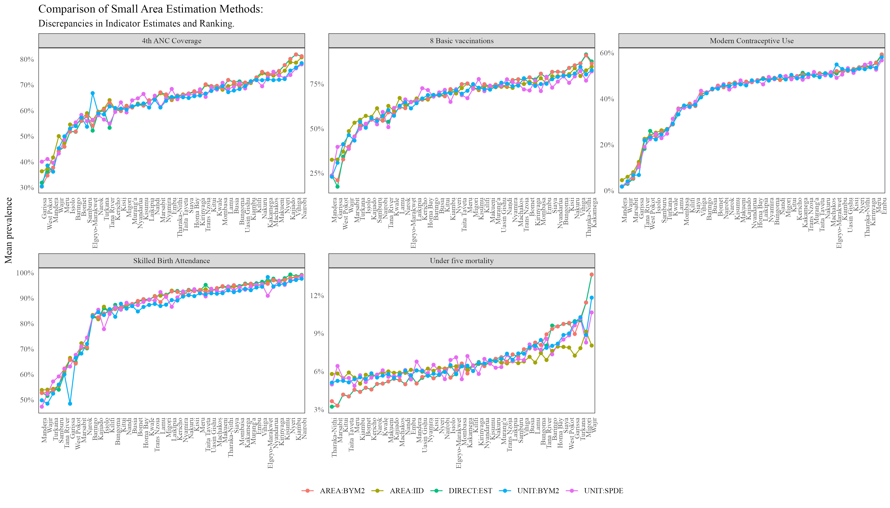
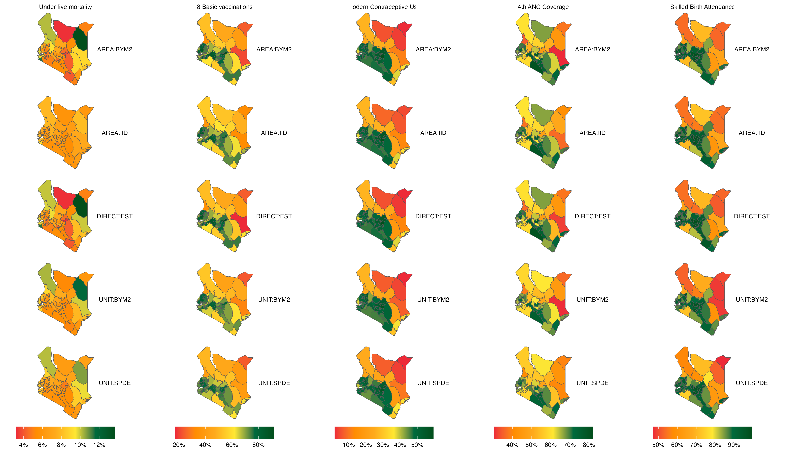
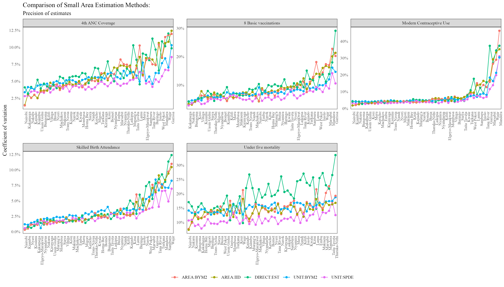

```{r, echo=F, warning=F, message=F}
# originally:       margin-width: 350px
pacman::p_load(dplyr, surveyPrev, ggplot2, INLA, raster, sf, terra, GGally, purrr, patchwork, recipes, ggpubr, earth, spdep, stringr, tidyr, knitr)

scientific_theme <- theme(
  # Text elements
  text = element_text(family = "serif", color = "black"),
  plot.title = element_text(size = 12, face = "plain", hjust = 0.5),
  axis.title = element_text(size = 12, face = "plain"),
  axis.text = element_text(size = 12),
  axis.text.x = element_text(angle = 0, hjust = 0.5),
  axis.text.y = element_text(angle = 0, hjust = 1),
  legend.title = element_text(size = 12),
  legend.text = element_text(size = 12),
  
  # Plot background and grid
  panel.background = element_rect(fill = "white"),
  panel.grid = element_blank(),
  
  # Axis lines and ticks
  axis.line = element_line(color = "black"),
  axis.ticks = element_line(color = "black"),
  
  # Remove the right and top axis lines (bty="l" equivalent)
  axis.line.y.right = element_blank(),
  axis.line.x.top = element_blank(),
  
  # Legend
  legend.background = element_rect(fill = "white"),
  legend.key = element_rect(fill = "white", color = NA),
  
  # Plot margins (approximating mar = c(5, 5, 3, 5))
  plot.margin = margin(t = 3, r = 5, b = 5, l = 5, unit = "pt"),
  
  # Expand axes to touch the data (xaxs="i", yaxs="i" equivalent)
  panel.spacing = unit(0, "lines"),
  plot.title.position = "plot"
)
```

# Introduction

A geographical region is termed a **small area** when the
domain-specific data for that region are insufficient to provide direct
estimates of adequate precision (Rao, John NK, and Isabel Molina,
2015)[^1]. Small Area Estimation (SAE) is a statistical method used to
estimate characteristics of interest for small spatial domains, often at
a sub-national level, such as counties in Kenya.

[^1]: Rao, John NK, and Isabel Molina. 2015. Small Area Estimation. John
    Wiley & Sons.

Small Area Estimation (SAE) has become increasingly valuable in survey data analysis, as demonstrated by its growing use in research and practice. The simplest SAE method, the design-based approach, uses sampling weights to account for complex survey designs and is used in the calculation of direct estimates (i.e., estimates derived solely from domain-specific survey data). In contrast, the model-based approach relies on statistical models that incorporate covariates to account for the sampling design. Model-based approaches offer the advantage of incorporating area-specific covariates as well as the potential for using promising model frameworks, for enhancing the precision of estimates. 

Given the reliance on statistical models, it is essential to evaluate and compare different model-based SAE approaches to determine their effectiveness in producing estimates with high precision. This article aims to formally compare several SAE methods for mapping variables of interest in Kenya, utilizing data from the Kenya Demographic and Health Survey (KDHS) 2022. This analysis draws inspiration from previous work on disease prevalence mapping by Wakefield, Okonek, and Pedersen (2020)[^2].

[^2]: Wakefield, Jonathan, Taylor Okonek, and Jon Pedersen. 2020. “Small
    Area Estimation for Disease Prevalence Mapping.” International
    Statistical Review 88 (2): 398–418.

The comparison will be based on the rankings produced by the models
investigated, their disparities, their coefficients of variation to
ascertain if the SAE models improved the precision of mean estimates.

# Data and Methods

## Data

The data for this analysis are sourced from the Kenya Demographic and
Health Survey 2022 (KDHS 2022). The survey utilizes the 2019 Kenya
Population and Housing Census National Master Sampling Frame (NMSF),
which divides Kenya into 47 administrative units (counties) and further
categorizes them into 92 strata based on rural and urban distinctions
(with Nairobi and Mombasa comprising only urban areas)

A two-stage sampling process is used to select samples within each
stratum. First enumeration areas/primary sampling units (PSU) are chosen
independently from each stratum using a probability proportional to size
(PPS) procedure. These form the survey clusters. Within each cluster, 25
households were selected using an equal probability systematic sampling
procedure. This resulted in 1692 clusters (urban: 666, rural: 1,026),
and a total of 42,300 households (urban: 16,650, rural: 25,650).

The sampling of the KDHS 2022 design ensures representative estimates at
the national, and rural-urban levels, and for some indicators, at the
county level.

The variables used in this analysis were extracted from the relevant DHS
recode datasets using the surveyPrev package[^3]

[^3]: Dong Q, Li Z, Wu Y, Boskovic A, Wakefield J (2024). *surveyPrev:
    Mapping the Prevalence of Binary Indicators using Survey Data in
    Small Areas*. R package version 1.0.0,
    <https://CRAN.R-project.org/package=surveyPrev>.

```{r tbl-vars}
#| echo: false
#| message: false

data.frame(
  Variable = c("Under five mortality", "Skilled birth attendance", "Full basic vaccination", "Modern contraceptive use", "4th ANC Coverage"),
  Description = c("Probability of dying within the first 59 months", "Assistance during delivery from a skilled provider", "Children 12-23 months with 8 basic vaccinations", "Modern contraceptive prevalence rate (Married women currently using any modern method of contraception)", "Antenatal visits during pregnancy: 4+ visits"),
  Topic = c("Infant & child mortality", "Maternal healthcare", "Child health", "Family planning", "Maternal Healthcare")
) |>
  kable(caption = NULL)

```

## Methods

As discussed by Wakefield, Jonathan, Taylor Okonek, and Jon Pedersen
(2020), this study implements five estimators for small area estimation:

1.  Direct estimation *(DIRECT)*
2.  An area-level model with independent and identically distributed
    (IID) random effects for counties *(AREA:IID)*
3.  An area-level model with a Besag-York-Mollié 2 (BYM2) spatial
    smoothing effect for counties *(AREA:BYM2)*
4.  A unit-level model with BYM2 spatial smoothing for counties
    *(UNIT:BYM2)*
5.  A unit-level model incorporating continuous Gaussian process
    smoothing *(UNIT:SPDE)*

For the remainder of this article, we adopt the following notation: let
$w_{ijk}$ represent the design weight for individual $i$ within cluster
$j$ in area (county) $k$, where the response for the selected variable
is denoted by $y_{ijk}$. The parameter of interest, $y_k$, refers to the
average prevalence of the selected indicators at the county level.

------------------------------------------------------------------------

For direct estimation, the direct estimator for the mean prevalence
value of the selected indicator at county $k$ is given as:

$$
y_k = \frac{\sum_{j=1}^{J_k} \sum_{i=1}^{n_{jk}} w_{ijk} y_{ijk}}{\sum_{j=1}^{J_k} \sum_{i=1}^{n_{jk}} w_{ijk}}
$$

Where: $J_k$ is the number of clusters in county $k$, and $n_{jk}$ is
the number of individuals in cluster $j$ of county $k$,

This formula represents the Horvitz-Thompson (HT) direct estimator for
the mean prevalence at the county level.

------------------------------------------------------------------------

The area level models: (AREA:IID) which assumes an IID heterogeneous
effect for the counties, and the (AREA:BYM2) which assigns a BYM2
spatial effect to the counties use the weighted estimate (HT) as their
response variable during modeling. Specifically: Let $y_k$ be the HT
direct estimate of county $k$, and $n_k$ be the effective sample size
for county $k$. Then:

$$y_k \sim Binomial(n_k, p_k)$$

For the area level model with IID random effect, the model is given
as:

$$\text{logit}(p_k) = x_k^T\beta + u_k + v_k$$

Here:

$y_k$ is the observed count in county $k$

$n_k$ is the effective sample size for county $k$

$p_k$ is the true underlying prevalence in county $k$

$x_k$ is a matrix of covariates (including the intercept) for county $k$

$\beta$ is a vector of coefficients

$u_k$ is the unstructured random effect for county $k$ given as
$u_k \sim N(0, \sigma_u^2)$. $\sigma_u^2$ is the variance of the
unstructured random effect.

------------------------------------------------------------------------

The model with the BYM2 spatial smoothing effect can be viewed as an
extension of the Besag-York-Mollie model given by the sum of an
unstructured random effect $u_k$, and a structured spatial random effect
$v_k$ with proper Conditional Auto-Regressive (CAR) structure[^4]

[^4]: Moraga, P. (2019). Geospatial health data: Modeling and
    visualization with R-INLA and shiny. Chapman and Hall/CRC.

The model formulation is as follows:

$$\text{logit}(p_k) = x_k^T\beta + b_k$$

The structured spatial random effect $b_k$ is given as:

$$b_k = \frac{1}{\tau_b}(\sqrt{1-\phi} \ v_k^{*} + \sqrt{\phi} \ u_k^{*})$$
Here: $u_k^{*}$ and $v_k^{*}$ are the standardized versions of $u_k$ and
$v_k$ to have variance 1[^5]. $\phi \in [0,1]$ is a mixing parameter
quantifying the proportion of marginal variance explained by the spatial
component. $\tau_b$ is the marginal precision parameter.

[^5]: Simpson, D., Rue, H., Riebler, A., Martins, T. G., & Sørbye, S. H.
    (2017). Penalising model component complexity: A principled,
    practical approach to constructing priors.

------------------------------------------------------------------------

For the unit-level models (UNIT:BYM2 & UNIT:SPDE), we consider the
primary sampling units (PSUs) as the units of analysis. Let $y_{jk}$
denote the count of "successes" for a selected indicator, and $n_{jk}$
represent the sample size for cluster $j$ in county $k$.

The general model formulation is as follows:

$$y_{jk} \sim \text{Beta-Binomial}(n_{jk}, p_{jk}, \lambda)$$
$$\text{logit}(p_{jk}) = x_{jk}^T\beta + z(s_{jk})\gamma + \psi(s_{jk})$$

Where:

$p_{jk}$ is the probability of success for cluster $j$ in county $k$

$x_{jk}$ is a vector of unit-level covariates at location $s_{jk}$

$\beta$ is the corresponding vector of fixed effect coefficients

$z(s_{jk})$ represents the stratum indicator for cluster $j$ in county
$k$

$\gamma$ is the fixed effect coefficient for the stratum

$\psi(s_{jk})$ is a spatial random effect at location $s_{jk}$

In the UNIT:SPDE model, the spatial random effect $\psi(s_{jk})$ is
modeled as a zero-mean Gaussian process with a Matérn covariance
function: $\psi(s_{jk}) \sim \mathcal{GP}(0, \Sigma)$. Here, $\Sigma$ is
the covariance matrix derived from the Matérn covariance function and is
characterized by parameters controlling the range of spatial dependency
and the smoothness of the spatial field. This model is then used to make
predictions for the selected indicator variable at a $5 km^2$ grid
across Kenya.

For the unit level model (UNIT:BYM2) implementing a BYM2 spatial random
effect, the term $\psi(s_{jk})$ is a spatially stuctured random effect
as implemented as in the *AREA:BYM2* section above.

------------------------------------------------------------------------

For the unit-level models that required the stratification variable
$z(\cdot)$ as a covariate, we first developed a model to predict
urban/rural classification for Kenya using the DHS GPS dataset. This was
done in two steps, and incorporated the covariates: night light, travel
time to cities with populations of 10,000-20,000, and population
density. Initially, we use a flexible Multivariate Adaptive Regression
Splines (MARS) model allowing for up to 100 knots and all second-order
interaction effects. Forward search was used to prune the model. The
predictions from this MARS model served as an offset linear predictor
term in a final geostatistical model, which made predictions at a
$5 \ km^2$ resolution. These predictions were then used as the
$z(\cdot)$ covariate in the unit-level models, representing the
probability that a cluster is urban.

For the unit-level models, since the primary sampling units (PSUs) are
the units of analysis rather than the areas (counties), an aggregation
step was required to obtain mean estimates at the county level.

In the UNIT:SPDE model which includes a continuous spatial random effect
(Gaussian process), the aggregation was done using population weighting.
The population dataset used was the UN-adjusted 2020 gridded population
data from WorldPop[^6] as follows:

[^6]: WorldPop (www.worldpop.org - School of Geography and Environmental
    Science, University of Southampton; Department of Geography and
    Geosciences, University of Louisville; Departement de Geographie,
    Universite de Namur) and Center for International Earth Science
    Information Network (CIESIN), Columbia University (2018). Global
    High Resolution Population Denominators Project - Funded by The Bill
    and Melinda Gates Foundation (OPP1134076).
    https://dx.doi.org/10.5258/SOTON/WP00675

$$
p_k = \sum_{i=1}^{g_i} p(s_i) \cdot q(s_i) \cdot \mathbf{1}(s_i \in k)
$$

Where $p(s_i)$ represents the mean estimate at location $s_i$ (a
$5 km^2$ grid), $q(s_i)$ is the population density at location $s_i$
(normalized per county $k$), and $g_i$ is the total number of grid cells
across the spatial domain (country).

For the UNIT:BYM2 model, aggregation was done using a weighted averaging
approach. Following (Paige, Fuglstad, Riebler, & Wakefield, 2022)[^7],
$a = 500$ samples for the county crossed with stratum were drawn from
the model's posterior distribution as follows:

[^7]: Paige, J., Fuglstad, G. A., Riebler, A., & Wakefield, J. (2022).
    Design-and model-based approaches to small-area estimation in a
    low-and middle-income country context: comparisons and
    recommendations. Journal of Survey Statistics and Methodology,
    10(1), 50-80.

$$\hat{P}_S^a = \frac{1}{J_k^s} \ \sum_{j:s[c] = S}{p_j^a}$$ Where:
$\hat{P}_S^a$ is the a-th drawn predicted probability from the posterior
of stratum $S$, $J_k^s$ is the number of clusters (Enumeration Areas) in
stratum $S$ of county $k$, $s[c]$ is the stratum of cluster $j$ and
$p_j^a$ is the predicted probability of cluster $j$.

Generating draws from the posterior distribution of the counties amounts
to aggregating the stratum draws, using information about the proportion
of each county that is urban/rural. This information was drawn from the
2019 Kenya Population and Housing Census (KPHC) 2019. This is
illustrated below:

$${p_k^a} = (q_{kU} * p_{U}^a) + (q_{kR} * p_{R}^a)$$

Here: $q_{kU}$ and $q_{kR}$ are the proportions for the target
populations in the counties which are urban and rural respectively.

------------------------------------------------------------------------

To fully specify the models, we used penalized complexity (PC) priors
similar to those used by Wakefield, Jonathan, Taylor Okonek, and Jon
Pedersen (2020). For the BYM2 models, the PC priors were set such that
the marginal standard deviation has a 0.01 probability of exceeding 0.5,
while the mixing parameter $\phi$ has a 0.5 probability of being greater
than 2/3. For the UNIT:SPDE model, we imposed a prior on the spatial
range parameter such that there is a 0.95 probability that the range is
less than 50 kilometers. Additionally, we set the prior for the marginal
standard deviation of the spatial field so that there is a 50%
probability that it is less than 1.


All analyses were performed in R version 4.3.2[^8], using packages
including Tidyverse, R-INLA, surveyPrev, sf, raster, earth, tidyr, and
patchwork.

[^8]: R Core Team (2023). R: A Language and Environment for Statistical
    Computing. R Foundation for Statistical Computing, Vienna, Austria.
    https://www.R-project.org/.

# Results

In this section, we present the comparative performance of the five
methods described in the Methods section. The results are evaluated
based on the rankings, the precision of the estimates using the
coefficient of variation (CV), and the influence of spatial
autocorrelation, sample size, and neighborhood structure on precision.

The plot of rankings and a prevalence map are shown below:



At the county level, all the methods produced almost similar rankings with an exception of Under-five mortality.

::: column-page-right

:::

From the above map, it is evident that for variables such as Modern Contraceptive Usage and Skilled Birth Attendance, there is strong visual similarity across the five methods, while for variables such as Under-five mortality, there exists some disparity in the plots produced using the different methods.

The coefficients of variation plot is shown below:



From the plot above, the UNIT:SPDE model seems to be having the lowest Coefficient of Variation (CV). For variables such as Modern Contraceptive Usage, the five models had relatively similar CV estimates across all counties, while for variables such as Under Five Mortality and 4th ANC Coverage, there is greater difference in the CV graphs produced.

---

In this article, we compared five model-based small area estimation (SAE) approaches using data from five indicators in the 2022 Kenya Demographic and Health Survey (KDHS). The findings suggest that the five models produced similar mean estimates and had comparable rankings for most of the variables. Variables such as skilled birth attendance and modern contraceptive use showed strong agreement among the models, while under-five mortality displayed lower agreement. Overall, the UNIT:SPDE models exhibited lower coefficients of variation across counties for all variables, though the CV graphs indicated that the models produced similar results.

These findings suggest that the KDHS 2022 data were sufficiently powered to generate estimates at the county level, as the model-based approaches did not significantly improve upon the direct estimates. Given that direct estimation remains the gold standard in SAE, my recommendation is to use direct estimation methods rather than model-based estimates for the counties and the five variables analyzed.

Further research is needed to assess the viability of model-based approaches for generating estimates at the sub-county level and to compare these approaches in greater depth.

# References

Paige, J., Fuglstad, G. A., Riebler, A., & Wakefield, J. (2022). Design-and model-based approaches to small-area estimation in a low-and middle-income country context: comparisons and recommendations. Journal of Survey Statistics and Methodology, 10(1), 50-80.

Simpson, D., Rue, H., Riebler, A., Martins, T. G., & Sørbye, S. H. (2017). Penalising model component complexity: A principled, practical approach to constructing priors.

Moraga, P. (2019). Geospatial health data: Modeling and visualization with R-INLA and shiny. Chapman and Hall/CRC.

Wakefield, Jonathan, Taylor Okonek, and Jon Pedersen. 2020. “Small Area Estimation for Disease Prevalence Mapping.” International Statistical Review 88 (2): 398–418.

Rao, John NK, and Isabel Molina. 2015. Small Area Estimation. John Wiley & Sons.

## Package references

R Core Team (2023). R: A Language and Environment for Statistical Computing. R Foundation for Statistical Computing, Vienna, Austria. https://www.R-project.org/.

Dong Q, Li Z, Wu Y, Boskovic A, Wakefield J (2024). surveyPrev: Mapping the Prevalence of Binary Indicators using Survey Data in Small Areas. R package version 1.0.0, https://CRAN.R-project.org/package=surveyPrev.

Wickham H, Miller E, Smith D (2023). *haven: Import and Export 'SPSS',
'Stata' and 'SAS' Files*. R package version 2.5.4,
<https://CRAN.R-project.org/package=haven>.

Havard Rue, Sara Martino, and Nicholas Chopin (2009), Approximate
Bayesian Inference for Latent Gaussian Models Using Integrated Nested
Laplace Approximations (with discussion), Journal of the Royal
Statistical Society B, 71, 319-392.

Thiago G. Martins, Daniel Simpson, Finn Lindgren and Havard Rue (2013),
Bayesian computing with INLA: New features, Computational Statistics and
Data Analysis, 67(2013) 68-83

Finn Lindgren, Havard Rue (2015). Bayesian Spatial Modelling with
R-INLA. Journal of Statistical Software, 63(19), 1-25. URL
http://www.jstatsoft.org/v63/i19/.

Wickham H, Averick M, Bryan J, Chang W, McGowan LD, François R,
Grolemund G, Hayes A, Henry L, Hester J, Kuhn M, Pedersen TL, Miller E,
Bache SM, Müller K, Ooms J, Robinson D, Seidel DP, Spinu V, Takahashi K,
Vaughan D, Wilke C, Woo K, Yutani H (2019). “Welcome to the tidyverse.”
*Journal of Open Source Software*, *4*(43), 1686.
doi:10.21105/joss.01686 <https://doi.org/10.21105/joss.01686>.

Pebesma, E., & Bivand, R. (2023). Spatial Data Science: With
Applications in R. Chapman and Hall/CRC.
https://doi.org/10.1201/9780429459016

Pebesma, E., 2018. Simple Features for R: Standardized Support for
Spatial Vector Data. The R Journal 10 (1), 439-446,
https://doi.org/10.32614/RJ-2018-009

Hijmans R (2023). *raster: Geographic Data Analysis and Modeling*. R
package version 3.6-26, <https://CRAN.R-project.org/package=raster>.

Kuhn M, Wickham H, Hvitfeldt E (2024). *recipes: Preprocessing and
Feature Engineering Steps for Modeling*. R package version 1.0.10,
<https://CRAN.R-project.org/package=recipes>.

## Data references

WorldPop (www.worldpop.org - School of Geography and Environmental Science, University of Southampton; Department of Geography and Geosciences, University of Louisville; Departement de Geographie, Universite de Namur) and Center for International Earth Science Information Network (CIESIN), Columbia University (2018). Global High Resolution Population Denominators Project - Funded by The Bill and Melinda Gates Foundation (OPP1134076). https://dx.doi.org/10.5258/SOTON/WP00675

KNBS and ICF. 2023. Kenya Demographic and Health Survey 2022.
    Nairobi, Kenya, and Rockville, Maryland, USA: KNBS and ICF.
    
