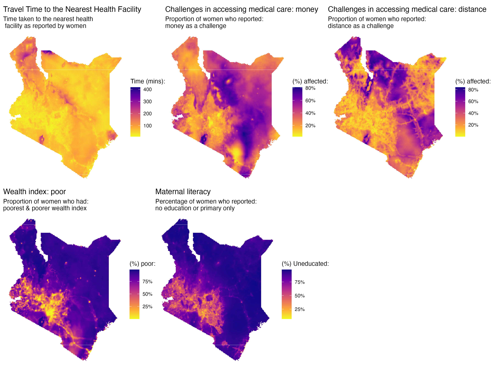
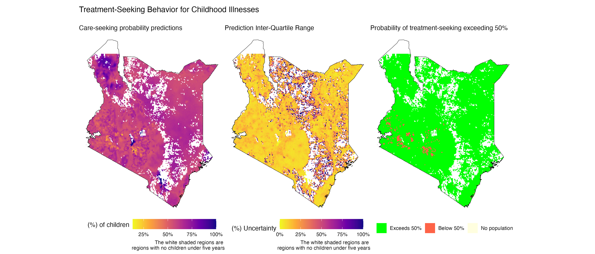
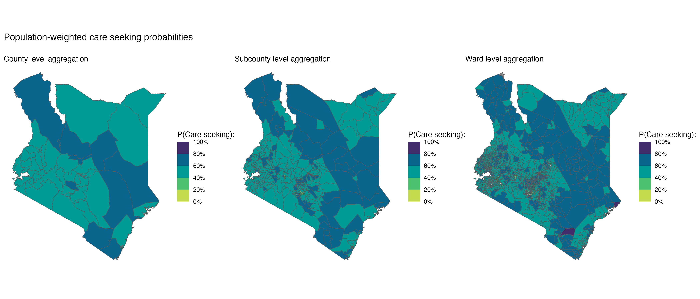
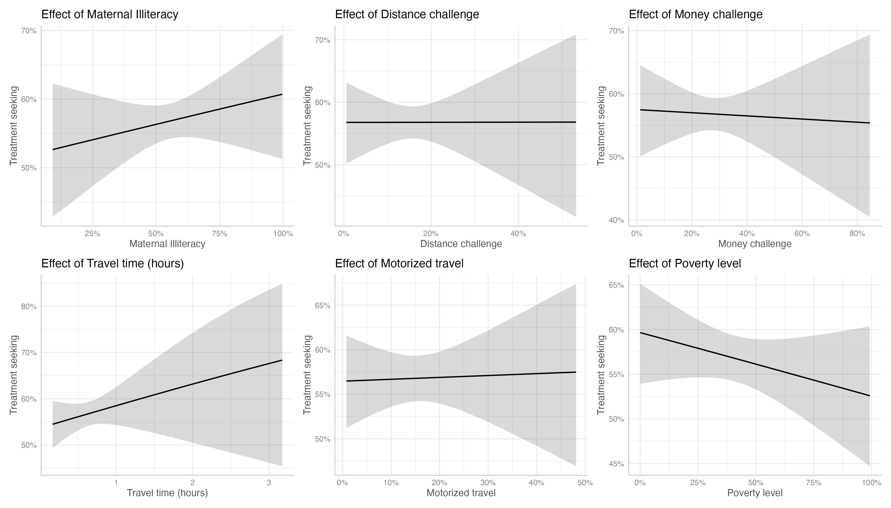

```{r setup}
#| echo: false
library(pacman)
p_load(dplyr, ggplot2, stringr, stringi, haven, naniar, sf, terra, geodata,
       raster, patchwork, viridis, rasterVis, INLA, ggpubr, recipes, mgcv,
       gamlss, gamlss.dist, gamlss.add)

main_dir <- "/Users/cema/Documents/GitHub/treatment-seeking"

# my theme
my_theme <- theme(
  # Text elements
  text = element_text(family = "serif", color = "black"),
  plot.title = element_text(size = 12, face = "plain", hjust = 0.5),
  axis.title = element_text(size = 12, face = "plain"),
  axis.text = element_text(size = 12),
  axis.text.x = element_text(angle = 0, hjust = 0.5),
  axis.text.y = element_text(angle = 0, hjust = 1),
  legend.title = element_text(size = 12),
  legend.text = element_text(size = 12),
  
  # Plot background and grid
  panel.background = element_rect(fill = "white"),
  panel.grid = element_blank(),
  
  # Axis lines and ticks
  axis.line = element_line(color = "black"),
  axis.ticks = element_line(color = "black"),
  
  # Remove the right and top axis lines (bty="l" equivalent)
  axis.line.y.right = element_blank(),
  axis.line.x.top = element_blank(),
  
  # Legend
  legend.background = element_rect(fill = "white"),
  legend.key = element_rect(fill = "white", color = NA),
  
  # Plot margins (approximating mar = c(5, 5, 3, 5))
  plot.margin = margin(t = 3, r = 5, b = 5, l = 5, unit = "pt"),
  
  # Expand axes to touch the data (xaxs="i", yaxs="i" equivalent)
  panel.spacing = unit(0, "lines"),
  plot.title.position = "plot"
)
```

# Introduction

Childhood illnesses remain a significant contributor to under-five
mortality globally, with diarrhea, malaria, and acute respiratory
infections (ARI) among the leading causes of death in this age
group[^1]. A comprehensive analysis of global, regional, and national
causes of under-5 mortality from 2000-2019 revealed that lower
respiratory infections accounted for approximately 10% of all under-five
deaths, while diarrhea was responsible for about 8.5% of these
fatalities[^2]. The burden is slightly higher in low- and middle-income
countries (LMICs), where diarrhea contributes to approximately 9% of
child mortality, and ARIs account for about 13%. Recent data from the
Institute for Health Metrics and Evaluation (2021)[^3] for Kenya,
indicates that diarrheal diseases have a mortality rate of 81.05 per
100,000 (95% CI: 59.97 - 106.02) for children under five years, while
lower respiratory infections (LRIs) exhibit a mortality rate of 63.11
per 100,000 (95% CI: 49.08 - 80.78) in the same age group.

[^1]: UNICEF Data. (2022, March). "Under-five mortality" Retrieved from
    https://data.unicef.org/topic/child-survival/under-five-mortality/

[^2]: Perin, J., Mulick, A., Yeung, D., Villavicencio, F., Lopez, G.,
    Strong, K. L., ... & Liu, L. (2022). Global, regional, and national
    causes of under-5 mortality in 2000–19: an updated systematic
    analysis with implications for the Sustainable Development Goals.
    The Lancet Child & Adolescent Health, 6(2), 106-115.

[^3]: https://vizhub.healthdata.org/gbd-compare/

Care-seeking for childhood illnesses in Kenya is often delayed or absent
due to various interconnected factors. Caregivers' understanding of
diseases, perception of illness severity and persistence, and financial
constraints (including direct: medical costs and indirect: lost work
time) significantly influence their decisions[^4]. Education levels and
cultural beliefs also play a role, often leading to the use of home
remedies instead of formal medical care[^5]. Geographical access to
healthcare facilities is another critical factor. Recent research shows
that 89.4% and 80.5% of Kenya's 2021 population could reach the nearest
public and private health facilities within an hour, respectively. While
27 out of 47 counties have over 90% of their population within an hour
of a public health facility, significant disparities remain, especially
in rural areas[^6]. People living in urban areas or close to healthcare
facilities are more likely to seek timely medical treatment for
childhood illnesses compared to those in rural areas$^4$, highlighting
the importance of geographical accessibility in care-seeking behavior.

[^4]: Wambui, W. M., Kimani, S., & Odhiambo, E. (2018). Determinants of
    Health Seeking Behavior among Caregivers of Infants Admitted with
    Acute Childhood Illnesses at Kenyatta National Hospital, Nairobi,
    Kenya. International journal of pediatrics, 2018, 5190287.
    https://doi.org/10.1155/2018/5190287

[^5]: Opuba EN, Owenga JA, Onyango PO. Home-based care practices and
    experiences influencing health-seeking behaviour among caregivers of
    children diagnosed with pneumonia in Endebess Sub-County, Kenya.
    Journal of Global Health Reports. 2021;5:e2021098.
    doi:10.29392/001c.29573

[^6]: Moturi AK, Suiyanka L, Mumo E, Snow RW, Okiro EA, Macharia PM.
    Geographic accessibility to public and private health facilities in
    Kenya in 2021: An updated geocoded inventory and spatial analysis.
    Front Public Health. 2022 Nov 3;10:1002975. doi:
    10.3389/fpubh.2022.1002975. PMID: 36407994; PMCID: PMC9670107.


The aim of this article is to:

1.  Estimate the probabilities of seeking treatment for childhood illnesses such as diarrhea andfever in Kenya, at a $5 \ km^2$ spatial resolution, and aggregated at the ward, sub-county, and county levels.

2.  Examine the relationship between care-seeking probabilities for
    childhood illnesses and access to medical care and treatment for
    women of reproductive age in Kenya, literacy levels, wealth
    disparities, and travel times and mode of travel to health
    facilities.

------------------------------------------------------------------------

# Data & methods

## Data

```{r load-data}
#| echo: false
#| message: false
#| warning: false

# main DHS data
load(paste0(main_dir, ('/data/2022 DHS/KEBR8AFL_2022.RData')))

# kenyan shape file with counties
bnd <- readRDS(paste0(main_dir, "/data/gadm/gadm41_KEN_1_pk.rds")) |>
  st_as_sf() |>
  dplyr::select(county = NAME_1, geometry)

# kenyan map boundary
kemap <- st_read(paste0(main_dir, "/data/gadm/gadm41_KEN_0.shp"), quiet = T)

# geocoded dataset
shp <- st_read(paste0(main_dir, "/data/2022 GeoData/KEGE8AFL/KEGE8AFL.shp"), quiet = T)
```

The data for this analysis are drawn from the Kenya Demographic and
Health Surveys 2022 (KDHS 2022)[^7].

[^7]: KNBS and ICF. 2023. Kenya Demographic and Health Survey 2022.
    Nairobi, Kenya, and Rockville, Maryland, USA: KNBS and ICF.

The KDHS is a nationally representative household survey conducted
periodically to collect data on population demographics, health, and
nutrition. The primary aim of these surveys is to monitor trends in key
indicators within developing countries which lack a robust vital
statistics collection and monitoring system.

The survey uses the most recent census national master sampling frame,
which divides Kenya into 47 administrative units (counties), each
further separated into 92 strata based on rural and urban specifications
(Nairobi and Mombasa only have urban areas, which is why the total \# of
strata is 92 not 94). Samples were selected within each stratum using a
two-stage process: First, clusters (enumeration areas) were selected
independently from each stratum. In the second stage, 25 households are
randomly selected from each cluster. This sampling design ensures
representative estimates at the national, county, and rural-urban
levels.

For this analysis, the survey datasets provided information on treatment
seeking for a total of 4,743 children under five years. A map showing
diarrhea, and fever prevalence and treatment seeking for the two
aggregated at the cluster level is shown below.

```{r data-wrangling}
#| echo: false
#| message: false
#| warning: false

shp <- shp |>
  dplyr::select(v001 = DHSCLUST, county = ADM1NAME, m1idence = URBAN_RURA,
         lat = LATNUM, lng = LONGNUM)


b1 <- birth |>
  dplyr::select(caseid, midx, v001, v005, b5, b2, 
                h11, h12y, h12z,    # diarrhea
                h22, h32y, h32z) |> # fever
  mutate(v005 = v005 / 1e6) |>
  as_factor()

b2 <- b1 |>
  mutate(
    across(
    .col = c('h11', 'h22', 'h12z', 'h32z'),
    .fns = \(x) {x = as.character(x); x = ifelse(is.na(x), "null", x); x}
  ),
  sick_recently = data.table::fifelse(h11 == "yes, last two weeks" | h22 == "yes", 1, 0, na = NA)) |>
  filter(sick_recently == 1 & b5 == "yes" & b2 >= 2017) |>
  mutate(seek_treatment = data.table::fifelse(h12z == "yes" | h32z == "yes", 1, 0, na = NA)) |>
  dplyr::select(caseid, v001, v005, seek_treatment)

# the response variables aggregated at the cluster level
resvars <- b2 |>
  group_by(v001) |>
  reframe(
    v005 = unique(v005),
    total_pop = dplyr::n(),
    num_seek = sum(seek_treatment, na.rm = T)
  ) |>
  merge(
    b2 |>
      group_by(v001) |>
      reframe(prop_seek_care = weighted.mean(seek_treatment, v005, na.rm = T)),
    by = 'v001'
  )

# merging with shapefiles
b2 <- b2 |>
  merge(shp |> dplyr::select(v001, lat, lng) |> st_drop_geometry(), by = 'v001')

# summarising at cluster level
b3 <- resvars
```

```{r clusterdata}
#| message: false
#| echo: false
#| warning: false

cluster_prev_map <- merge(
  shp |> dplyr::select(v001, county, geometry),
  resvars,
  by = "v001"
)
```

```{r mapping-data}
#| echo: false
#| message: false
#| warning: false
#| fig-width: 12
#| fig-height: 6

p2 <- cluster_prev_map |>
  ggplot() + 
  geom_sf(data = bnd, aes(geometry = geometry), fill = "white", col = "black") +
  geom_sf(aes(col = prop_seek_care), size = .7) +
  scale_color_stepsn(colours = hcl.colors(5),
                     labels = scales::percent_format()) +
  labs(col = "Diarrhea & Fever prevalence\n in clusters",
       # title = "Kenya-DHS 2022",
       subtitle = "Had diarrhea recently ?") +
  theme_void() +
  theme(legend.position = "bottom",
        text = element_text(family = "serif", color = "black"))

p3 <- cluster_prev_map |>
  ggplot() + 
  geom_sf(data = bnd, aes(geometry = geometry), fill = "white", col = "black") +
  geom_sf(aes(col = prop_seek_care), size = .7) +
  scale_color_stepsn(colours = hcl.colors(5),
                     labels = scales::percent_format()) +
  labs(col = expression("P(Treatment Seeking):"),
       # title = "Kenya-DHS 2022",
       subtitle = "Diarrhea & Fever Treatment Seeking (TS)") +
  theme_void() +
  theme(legend.position = "bottom",
        text = element_text(family = "serif", color = "black"))

p2 | p3
```

## Methods

We utilize six covariates in modeling care-seeking behavior for diarrhea
and fever in children under five. These covariates include:

1.  Travel time (minutes to the nearest health facility)
2.  Health accessibility (1) (proportion of women experiencing
    challenges in accessing healthcare due to money)
3.  Health accessibility (2) (proportion of women experiencing
    challenges in accessing healthcare due to distance)
4.  Mode of travel (proportion of women using motorized transport to
    access the nearest health facility)
5.  Wealth (proportion of women from poor wealth index bracket)
6.  Illiteracy levels in women (proportion of women with primary
    education or less)

These six covariates were first estimated using a two-step model-based
geostatistics (MBG) approach to obtain estimates at a $5 km^2$ spatial
resolution. This initial step considered the following selected
environmental covariates:

```{r env-covs}
#| echo: false
#| message: false
#| warning: false
data.frame(
  Variable = c("Avg-Temp", "Diff-Temp", "Precipitation", "Distance to water bodies", "Night-time light", "Population density", "Travel time to cities"),
  Description = c("The average temperature in degree celsius", "The temperature difference between the minimum average and maximum average", "Total precipitation in mm", "Distance to ESA-CCI-LC inland water (2012)", "Resampled VIIRS night-time light", "Unconstrained estimated population density per grid cell, UN Adjusted for 2020.", "Travel time to cities with populations of 10k-20k people in 2015 "),
  Source = c("WorldClim version 2.1 climate data", "WorldClim version 2.1 climate data", "WorldClim version 2.1 climate data", "WorldPop (www.worldpop.org)", "WorldPop (www.worldpop.org)", "WorldPop (www.worldpop.org)", "https://doi.org/10.6084/m9.figshare.7638134.v4")
) |>
  knitr::kable()
```

In the first step, Multivariate Adaptive Regression Spline models (MARS) were used in modelling the 6 covariates as a function of all the environmental covariates and their first-order interaction terms. The models were built to allow for a potential 500 knots in the features, and pruning of the model was done using forward selection. The predictions from the MARS model were then used as offsets in a geostatistical model (second step) in order to obtain the smoothed effects over the entire grid.

For travel time, which exhibits a skewed distribution, we employed a
gamma distribution model:

$$
\log(\text{Travel Time}_k) = \mathbf{Z}_k + \psi(x_k)
$$

For the remaining covariates (health accessibility (money & distance),
mode of travel, wealth index, and illiteracy levels), we applied a
binomial likelihood model.

$$
\text{logit}(p_k) = \mathbf{Z}_k + \psi(x_k)
$$

Where: $\mathbf{Z}_k$ is an offset term which is the linear predictor obtained from the fitted MARS model and $\psi(x_k)$ is a spatial random effect modeled as a zero-mean Gaussian process with a Matérn covariance function: $\psi(x_k) \sim N(0, \Sigma)$.


# Results

These six modeled map surfaces were then used as covariates in the
models for care-seeking probabilities.

{fig-align="center"}

------------------------------------------------------------------------

To model the response variables related to care-seeking for diarrhea and
fever, we used a generalized linear geostatistical model with a binomial
response distribution. Let $Y_k$ be the number of women in location
$x_k, \ (k = 1, ..., n)$ who sought treatment for their children (under
five) due to diarrhea or fever. We assume:

$$
Y_k \ | \ \mu(x_k) \sim \text{Binomial}(N_k, \ \mu(x_k))
$$ where:

$N_k$ is the total number of women in location $k$. $\mu(x_k)$ is the
probability parameter of the binomial distribution, with
$0 < \mu(x_k) < 1$.

The probability $\mu(x_k)$ is linked to the covariates and spatial
effects through a logit link function:

$$
\mathbf{log}(\frac{\mu(x_k)}{1 - \mu(x_k)}) = \mathbf{X}_k \boldsymbol{\beta} + \psi(x_k)
$$

where:

$\mathbf{X}_k$ is the vector of the six estimated covariates at location
$x_k$, and $\boldsymbol{\beta}$ is the vector of corresponding
regression coefficients (including the intercept term). $\psi(x_k)$
represents a spatial random effect modeled as a zero-mean Gaussian
process with Matérn covariance function: $\psi(x_k) \sim N(0, \Sigma)$.

For summarizing the care-seeking probabilities, we extracted the mean probabilities along with the interquartile range (IQR) as a measure of uncertainty in predictions. The estimates were also aggregated at the ward, sub-county and county level using population-weighting.

{fig-align="center"}

The modelled map surface indicates that care seeking probabilities ranged from 0 to 1, with a median probability of 0.6, and an average probability of 0.51. Care seeking was high in the northern regions of Kenya such as in Turkana, and low in the central parts of Kenya such as in Nairobi. The exceedance map shows that majority of the parts in Kenya have a care seeking probability above 0.5.

The aggregated map surfaces shown below indicate that at the county level, treatment seeking is high (60% - 80%) in the counties: Turkana, Samburu, Isiolo, Garissa, Tana-river, Taita taveta, Kwale and Murang'a. The rest of the counties have treatment seeking probabilities ranging from 40% to 60%. the sub-county level map and ward-level map further highlight this finding.

{fig-align="center"}

The effects of the health accessibility covariates on the treatment seeking probabilities were extracted from a GLM model fitted on the survey data (aggregated at the cluster level). The conditional effect plots are shown below:

{fig-align="center"}


Higher levels of female illiteracy are associated with an increased probability of seeking treatment. There is a slight negative association between money-related challenges and seeking treatment, and a strong negative relationship between poverty levels and treatment seeking. Contrary to expectations, longer travel times are associated with a higher likelihood of seeking treatment. The variables: distance challenges and access to motorized transport show little to no impact on treatment-seeking behavior, as reflected in the flat prediction lines.

---

This study modeled the probabilities of treatment seeking for childhood illnesses in Kenya using model-based geostatistical methods. The findings reveal an interesting trend: treatment-seeking probabilities are highest in northern counties such as Turkana, Isiolo, and Samburu, while much of the rest of Kenya exhibits moderate probabilities, ranging between 40% and 60%. Additionally, the study explored how health accessibility factors relate to treatment seeking.

A key limitation of this research is the restricted sample size. The DHS data on treatment seeking was collected only from women whose children experienced illness in the two weeks preceding the survey, significantly reducing the number of observations. Similarly, data on health accessibility variables were available for only a subset of respondents. These limitations likely contributed to the low precision of the estimated relationships, as evidenced by the wide confidence intervals around the model’s predictions.

Although some of the results were counterintuitive, they highlight the complexity of healthcare access and utilization. Further research is needed to better understand the relationships between health accessibility and treatment seeking for childhood illnesses.


# References

## Data references

Fick, S.E. and R.J. Hijmans, 2017. WorldClim 2: new 1km spatial
resolution climate surfaces for global land areas. International Journal
of Climatology 37 (12): 4302-4315.

WorldPop (www.worldpop.org - School of Geography and Environmental
Science, University of Southampton; Department of Geography and
Geosciences, University of Louisville; Departement de Geographie,
Universite de Namur) and Center for International Earth Science
Information Network (CIESIN), Columbia University (2018). Global High
Resolution Population Denominators Project - Funded by The Bill and
Melinda Gates Foundation (OPP1134076).
https://dx.doi.org/10.5258/SOTON/WP00675

Nelson, Andy (2019). Travel time to cities and ports in the year 2015.
figshare. Dataset. https://doi.org/10.6084/m9.figshare.7638134.v4

Weiss, D., Nelson, A., Gibson, H. et al. A global map of travel time to
cities to assess inequalities in accessibility in 2015. Nature 553,
333–336 (2018). https://doi.org/10.1038/nature25181

## Package references

Havard Rue, Sara Martino, and Nicholas Chopin (2009), Approximate
Bayesian Inference for Latent Gaussian Models Using Integrated Nested
Laplace Approximations (with discussion), Journal of the Royal
Statistical Society B, 71, 319-392.

Thiago G. Martins, Daniel Simpson, Finn Lindgren and Havard Rue (2013),
Bayesian computing with INLA: New features, Computational Statistics and
Data Analysis, 67(2013) 68-83

Finn Lindgren, Havard Rue (2015). Bayesian Spatial Modelling with
R-INLA. Journal of Statistical Software, 63(19), 1-25. URL
http://www.jstatsoft.org/v63/i19/.

Wickham H, Averick M, Bryan J, Chang W, McGowan LD, François R,
Grolemund G, Hayes A, Henry L, Hester J, Kuhn M, Pedersen TL, Miller E,
Bache SM, Müller K, Ooms J, Robinson D, Seidel DP, Spinu V, Takahashi K,
Vaughan D, Wilke C, Woo K, Yutani H (2019). “Welcome to the tidyverse.”
*Journal of Open Source Software*, *4*(43), 1686.
doi:10.21105/joss.01686 <https://doi.org/10.21105/joss.01686>.

R Core Team (2023). *R: A Language and Environment for Statistical
Computing*. R Foundation for Statistical Computing, Vienna, Austria.
<https://www.R-project.org/>.

Pebesma, E., & Bivand, R. (2023). Spatial Data Science: With
Applications in R. Chapman and Hall/CRC.
https://doi.org/10.1201/9780429459016

Pebesma, E., 2018. Simple Features for R: Standardized Support for
Spatial Vector Data. The R Journal 10 (1), 439-446,
https://doi.org/10.32614/RJ-2018-009

Hijmans R (2023). *raster: Geographic Data Analysis and Modeling*. R
package version 3.6-26, <https://CRAN.R-project.org/package=raster>.

Kuhn M, Wickham H, Hvitfeldt E (2024). *recipes: Preprocessing and
Feature Engineering Steps for Modeling*. R package version 1.0.10,
<https://CRAN.R-project.org/package=recipes>.

Karatzoglou A, Smola A, Hornik K (2023). *kernlab: Kernel-Based Machine
Learning Lab*. R package version 0.9-32,
<https://CRAN.R-project.org/package=kernlab>.

Wickham H, Miller E, Smith D (2023). *haven: Import and Export 'SPSS',
'Stata' and 'SAS' Files*. R package version 2.5.4,
<https://CRAN.R-project.org/package=haven>.

Alexander Jordan, Fabian Krueger, Sebastian Lerch (2019). Evaluating
Probabilistic Forecasts with scoringRules. Journal of Statistical
Software, 90(12), 1-37. DOI 10.18637/jss.v090.i12
  
Mahoney M. J., Johnson, L. K., Silge, J., Frick, H., Kuhn, M., and
Beier C. M. (2023). Assessing the performance of spatial
cross-validation approaches for models of spatially structured data.
arXiv. https://doi.org/10.48550/arXiv.2303.07334

## Other references

UNICEF Data. (2022, March). "Under-five mortality" Retrieved from
    https://data.unicef.org/topic/child-survival/under-five-mortality/

Perin, J., Mulick, A., Yeung, D., Villavicencio, F., Lopez, G.,
    Strong, K. L., ... & Liu, L. (2022). Global, regional, and national
    causes of under-5 mortality in 2000–19: an updated systematic
    analysis with implications for the Sustainable Development Goals.
    The Lancet Child & Adolescent Health, 6(2), 106-115.

Wambui, W. M., Kimani, S., & Odhiambo, E. (2018). Determinants of
    Health Seeking Behavior among Caregivers of Infants Admitted with
    Acute Childhood Illnesses at Kenyatta National Hospital, Nairobi,
    Kenya. International journal of pediatrics, 2018, 5190287.
    https://doi.org/10.1155/2018/5190287

Opuba EN, Owenga JA, Onyango PO. Home-based care practices and
    experiences influencing health-seeking behaviour among caregivers of
    children diagnosed with pneumonia in Endebess Sub-County, Kenya.
    Journal of Global Health Reports. 2021;5:e2021098.
    doi:10.29392/001c.29573

Moturi AK, Suiyanka L, Mumo E, Snow RW, Okiro EA, Macharia PM.
    Geographic accessibility to public and private health facilities in
    Kenya in 2021: An updated geocoded inventory and spatial analysis.
    Front Public Health. 2022 Nov 3;10:1002975. doi:
    10.3389/fpubh.2022.1002975. PMID: 36407994; PMCID: PMC9670107.
    
KNBS and ICF. 2023. Kenya Demographic and Health Survey 2022.
    Nairobi, Kenya, and Rockville, Maryland, USA: KNBS and ICF.
